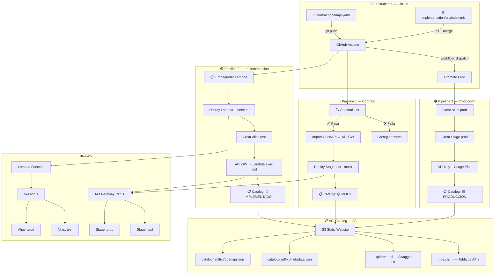
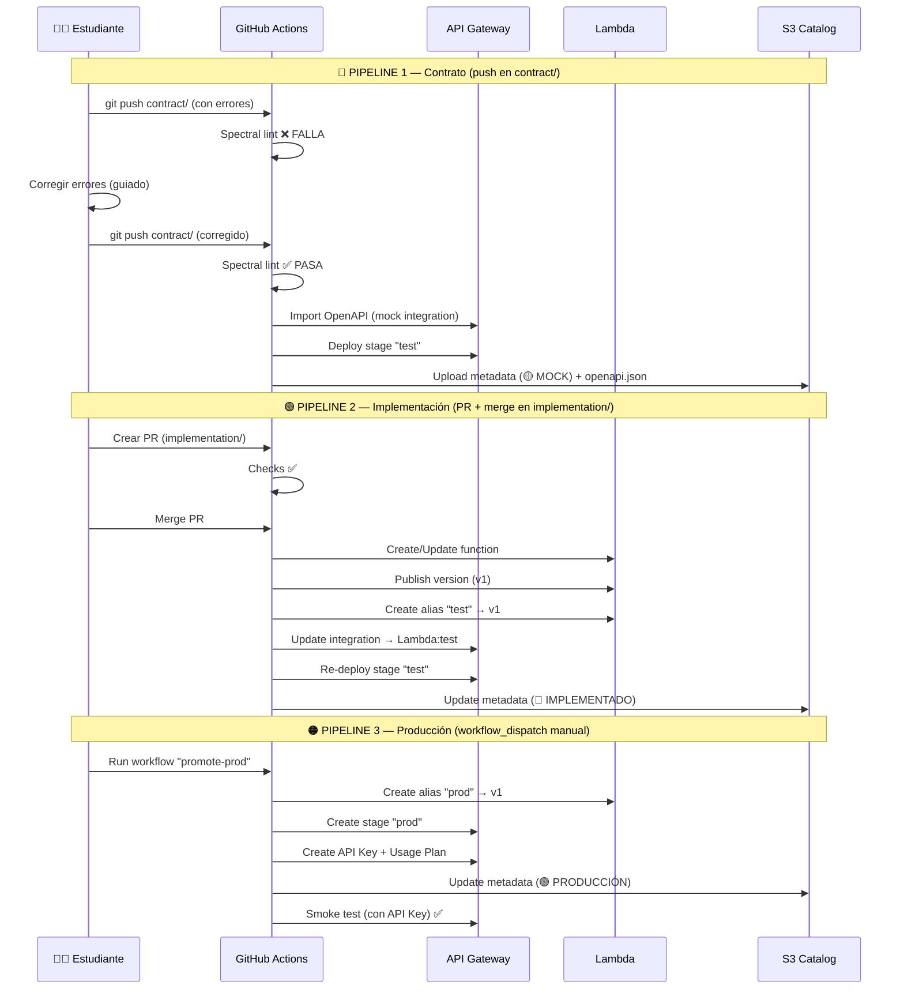

# MOD7-LAB4: Ciclo de Vida de una API — Del Linting al Catálogo

**Instructor:** Miguel Leyva

---

##  1. Objetivo y Alcance

### Objetivo

Implementar el **ciclo de vida completo de una API** con gobernanza automatizada, desde la validación del contrato OpenAPI hasta su publicación en un catálogo centralizado, utilizando **GitHub Actions** como motor de CI/CD y **AWS** como plataforma cloud.

### Al finalizar el laboratorio, serás capaz de:

1. Validar contratos OpenAPI contra estándares de gobernanza usando **Spectral** (linter)
2. Desplegar una API en modo **mock** en AWS API Gateway para pruebas tempranas
3. Implementar un **AWS Lambda** con versionado (versions + aliases) como backend real
4. Promover una API de **test → producción** de forma controlada
5. Proteger el endpoint de producción con **API Key + Usage Plan**
6. Publicar tu API en un **catálogo centralizado** con documentación interactiva (Swagger UI)
7. Entender cómo se automatiza la gobernanza de APIs en un pipeline CI/CD

### Alcance

| Incluido | 
|----------|
| API Gateway REST (mock + Lambda) |
| Lambda con versions y aliases |
| Linting con Spectral |
| Catálogo estático en S3 con Swagger UI |
| GitHub Actions (CI/CD) |
| Despliegue en AWS |
| API Key + Usage Plan |

### Contexto Multi-nube

Este laboratorio se despliega en **AWS**, pero la arquitectura del catálogo está diseñada para ser **multi-nube**. Cada API registrada en el catálogo incluye un campo `cloud` en sus metadatos que indica en qué proveedor está desplegada. En un futuro, se podrían agregar pipelines adicionales para desplegar APIs en **Azure** (API Management + Azure Functions) y **GCP** (Apigee + Cloud Functions), y todas se registrarían en el mismo catálogo centralizado.

---

## 2. Pre-requisitos

| Requisito | Detalle |
|-----------|---------|
| **Cuenta GitHub** | Gratuita — [github.com](https://github.com) |
| **Cuenta AWS** | Proporcionada por el instructor (AWS Academy / Learner Lab) |
| **AWS Access Keys** | `AWS_ACCESS_KEY_ID`, `AWS_SECRET_ACCESS_KEY` y `AWS_SESSION_TOKEN` del lab |
| **Navegador web** | Chrome, Firefox o Edge (versión reciente) |
| **Postman** | Postman aplicación o web |
| **Suffix asignado** | Número del 01 al 35 (proporcionado por el instructor) |
| **URL del catálogo** | Proporcionada por el instructor |
| **Conocimientos previos** | Sesiones 1-3 del curso (APIs REST, OpenAPI, API Gateway) |

---

## 3. Arquitectura

### Diagrama General



### Flujo de los 3 Pipelines



---

## 4. Estructura del Repositorio

```
api-lifecycle-lab/
├── README.md                          ← 👨‍🎓 Este archivo (lab del estudiante)
├── .github/workflows/
│   ├── contract-pipeline.yml          ← 🔵 Lint + Mock
│   ├── implementation-pipeline.yml    ← 🟢 Lambda + Test
│   ├── promote-prod.yml               ← 🟠 Producción (manual)
│   └── cleanup.yml                    ← 🔴 Limpieza (manual)
├── contract/
│   ├── openapi.yaml                   ← OpenAPI con errores intencionales
│   └── .spectral.yml                  ← Reglas de gobernanza
├── implementation/
│   └── src/
│       └── index.mjs                  ← Lambda handler
├── scripts/
│   ├── 01-deploy-mock.sh
│   ├── 02-deploy-lambda-test.sh
│   ├── 03-update-api-integration.sh
│   ├── 04-promote-prod.sh
│   ├── 05-update-catalog.sh
│   └── 99-cleanup.sh
└── api-catalog/                       ← 👨‍🏫 Solo instructor
    ├── README.md
    ├── deploy-catalog.sh
    ├── destroy-catalog.sh
    ├── config.env
    ├── frontend/
    │   ├── index.html
    │   ├── explorer.html
    │   ├── assets/
    │   │   ├── style.css
    │   │   ├── catalog.js
    │   │   └── explorer.js
    │   └── swagger-ui/
    │       └── (descargar con deploy-catalog.sh)
    └── templates/
        ├── metadata-template.json
        └── manifest-template.json
```

---

## 5. Laboratorio Guiado

> **API a implementar:** `GET /clientes/{clienteId}/cuentas` — Consultar cuentas bancarias de un cliente

---

### Fase 0 — Setup Inicial

#### 0.1 — Fork del repositorio

1. Ve al repositorio del instructor en GitHub.
2. Haz clic en **Fork** (esquina superior derecha).
3. Selecciona tu cuenta personal como destino.
4. Espera a que se complete el fork.

#### 0.2 — Configurar GitHub Secrets y Variables

1. En **tu fork**, ve a **Settings → Secrets and variables → Actions**.
2. Asegúrate de estar en la pestaña **Secrets** y usa el botón **New repository secret** para crear los siguientes (no uses "Environment secrets"):

| Secret Name | Valor |
|-------------|-------|
| `AWS_ACCESS_KEY_ID` | (Utilizas credenciales del Access Portal de AWS) |
| `AWS_SECRET_ACCESS_KEY` | (Utilizas credenciales del Access Portal de AWS) |
| `AWS_SESSION_TOKEN` | (Utilizas credenciales del Access Portal de AWS) |
| `AWS_REGION` | `us-east-1` |
| `CATALOG_BUCKET` | `api-catalog-sesion4`  |
| `LAMBDA_ROLE_ARN` | `Copiar el ARN de lab-lambda-role en IAM > Roles` |

3. En la pestaña **Variables**, usa el botón **New repository variable** para crear la siguiente:

| Variable Name | Valor |
|---------------|-------|
| `SUFFIX` | Tu número asignado (ej: `07`) |

---

### Fase 1 — Pipeline del Contrato: Lint + Mock

#### 1.1 — Disparar el pipeline (con errores intencionales)

El archivo `contract/openapi.yaml` ya tiene **2 errores intencionales** de gobernanza. Para que GitHub Actions detecte el cambio y ejecute el pipeline, realiza un pequeño cambio estético en el archivo (ej: agrega un espacio al final o cambia la descripción en la línea 2) usando cualquiera de estos dos métodos:

**Opción A: Desde el Editor Web de GitHub (Recomendado para rapidez)**
1. En GitHub, navega al archivo `contract/openapi.yaml`.
2. Haz clic en el icono del **lápiz (Edit this file)**.
3. Agrega un espacio al final del archivo o cambia el texto de la descripción.
4. Haz clic en **Commit changes...**.
5. En el mensaje de commit pon: `chore: validar gobernanza del contrato`.
6. Selecciona "Commit directly to the main branch" y dale a **Commit changes**.

> 💡 **Tip**: También puedes ir a la pestaña **Actions** en GitHub, seleccionar **"Contract Pipeline"** y hacer clic en **"Run workflow"** ya que se tiene activo el `workflow_dispatch`.

#### 1.2 — Verificar que el pipeline FALLA ❌

1. Ve a la pestaña **Actions** en tu repositorio.
2. Verás el workflow **"Contract Pipeline"** ejecutándose.
3. El job **"lint"** fallará ❌.
4. Haz clic en el job → expande el step **"Run Spectral Lint"**.

#### 1.3 — Revisar los errores en el log

Verás un output similar a:

```
contract/openapi.yaml
..

✖ n problems (a errors, b warnings, c infos)
```

#### 1.4 — Corregir los errores

Abre `contract/openapi.yaml`. Verás que la mayoría de los problemas ya están resueltos, pero hemos dejado **2 errores intencionales** para que los corrijas siguiendo las instrucciones en los comentarios del archivo:

| # | Error | Acción en `openapi.yaml` |
|---|-------|-----------|
| 1 | `version: ""` | Cambiar a `version: "1.0.0"` |
| 2 | Falta `operationId` | Descomentar la línea `# operationId: listarCuentasCliente` |

> 💡 **Tip**: Busca los comentarios marcados con `❌ ERROR` en el archivo para identificar dónde realizar los cambios. Una vez corregidos, deben verse como los bloques marcados con `✅ YA CORREGIDO`.

#### 1.5 — Hacer push (corregido vía Web)

1. Una vez realizados los cambios en el archivo `contract/openapi.yaml` dentro del editor de GitHub.
2. Haz clic en el botón **Commit changes...** (arriba a la derecha).
3. En el mensaje de commit pon: `fix: corregir errores de gobernanza en openapi`.
4. Selecciona **"Commit directly to the main branch"**.
5. Haz clic en **Commit changes**.

> ⏳ El Pipeline 1 se ejecuta nuevamente:
> 1. ✅ **Lint** — Spectral pasa sin errores
> 2. ✅ **Deploy Mock** — Crea API Gateway con integración mock + stage `test`
> 3. ✅ **Smoke Test** — Valida que el mock responde correctamente
> 4. ✅ **Update Catalog** — Sube metadata (🟡 MOCK) y openapi.json al S3

#### 1.6 — Verificar resultados

1. **GitHub Actions**: El workflow muestra todos los jobs en verde ✅.
2. **AWS Console → API Gateway**: Verás `cuentas-api-{suffix}` con stage `test`.
3. **Catálogo Web**: Abre la URL del catálogo → tu API aparece con badge **🟡 MOCK**.
4. **Probar el mock**:
   ```bash
   curl https://{api-id}.execute-api.us-east-1.amazonaws.com/test/clientes/CLI001/cuentas
   ```
   Respuesta mock:
   ```json
   {
     "statusCode": 200,
     "body": {
       "clienteId": "CLI001",
       "cuentas": [
         { "numeroCuenta": "1234567890", "tipo": "AHORROS", "saldo": 5000.00 }
       ]
     }
   }
   ```

---

### Fase 2 — Pipeline de Implementación: Lambda + Test

#### 2.1 — Crear una rama (vía Web)

1. En la página principal de tu repositorio en GitHub, haz clic en el selector de ramas (**main**).
2. Escribe `feature/implementation` en el cuadro de texto.
3. Haz clic en **Create branch: feature/implementation from main**.

#### 2.2 — Revisar y personalizar el código Lambda (vía Web)

1. Navega al archivo `implementation/src/index.mjs`.
2. Haz clic en el icono del **lápiz (Edit this file)**.
3. El código ya viene funcional. Personaliza los datos de ejemplo cambiando el valor del campo `titular` por el **nombre del estudiante**.
4. Haz clic en **Commit changes...**.
5. En el mensaje de commit pon: `feat: implementar Lambda con nombre del estudiante`.
6. Asegúrate de seleccionar **"Commit directly to the feature/implementation branch"**.
7. Haz clic en **Commit changes**.

#### 2.3 — Crear Pull Request (vía Web)

1. Después de hacer el commit, verás un banner amarillo con el botón **"Compare & pull request"** → haz clic en él.
2. Título: `feat: implementar endpoint cuentas`.
3. Haz clic en **"Create pull request"**.
4. Espera a que los **checks pasen** ✅ (el pipeline ejecuta validaciones).

#### 2.4 — Merge del Pull Request

1. Una vez que los checks pasen ✅, haz clic en **"Merge pull request"**.
2. Confirma el merge.

> ⏳ El Pipeline 2 se ejecuta automáticamente:
> 1. ✅ **Build** — Empaqueta el código Lambda en ZIP
> 2. ✅ **Deploy Lambda** — Crea/actualiza función + publica versión + crea alias `test`
> 3. ✅ **Update API GW** — Cambia integración de mock → Lambda alias `test`
> 4. ✅ **Smoke Test** — Valida respuesta real del Lambda
> 5. ✅ **Update Catalog** — Actualiza metadata a 🔵 IMPLEMENTADO

#### 2.5 — Verificar resultados

1. **AWS Console → Lambda**: Verás `cuentas-lambda-{suffix}` con versión 1 y alias `test`.
2. **AWS Console → API Gateway**: La integración ahora dice **Lambda Function** (ya no mock).
3. **Catálogo Web**: Tu API muestra badge **🔵 IMPLEMENTADO**.
4. **Probar la implementación real**:
   ```bash
   curl https://{api-id}.execute-api.us-east-1.amazonaws.com/test/clientes/CLI001/cuentas
   ```
   Ahora devuelve datos reales del Lambda (no mock).

---

### Fase 3 — Promoción a Producción

#### 3.1 — Ejecutar pipeline manualmente

1. Ve a **Actions** → selecciona **"Promote to Production"**.
2. Clic en **"Run workflow"** → selecciona branch `main` → **"Run workflow"**.

> ⏳ El Pipeline 3 se ejecuta:
> 1. ✅ **Create alias prod** — Apunta a la misma versión probada en test
> 2. ✅ **Create stage prod** — Nuevo stage en API Gateway
> 3. ✅ **API Key + Usage Plan** — Protege el endpoint de producción
> 4. ✅ **Smoke Test** — Valida con API Key (200) y sin API Key (403)
> 5. ✅ **Update Catalog** — Actualiza metadata a 🟢 PRODUCCIÓN

#### 3.2 — Verificar resultados

1. **Lambda**: Alias `prod` apuntando a versión 1.
2. **API Gateway**: Stage `prod` activo.
3. **Catálogo**: Badge **🟢 PRODUCCIÓN** + 🔐 API Key.
4. **Probar endpoint de producción**:

   Sin API Key (debe dar 403):
   ```bash
   curl https://{api-id}.execute-api.us-east-1.amazonaws.com/prod/clientes/CLI001/cuentas
   # → 403 Forbidden
   ```

   Con API Key (debe dar 200):
   ```bash
   curl -H "x-api-key: {TU_API_KEY}" \
     https://{api-id}.execute-api.us-east-1.amazonaws.com/prod/clientes/CLI001/cuentas
   # → 200 OK + datos
   ```

   > 💡 El API Key se muestra en el log del pipeline o en la consola de API Gateway.

---

### Fase 4 — Exploración del Catálogo

#### 4.1 — Abrir el catálogo web

Navega a la URL del catálogo proporcionada por el instructor.

#### 4.2 — Explorar tu API

1. Busca tu API en la tabla (por tu suffix).
2. Verifica que el estado sea **🟢 PRODUCCIÓN** y la nube sea **AWS**.
3. Haz clic en **[📖 Explorar]**.
4. Se abrirá Swagger UI con tu definición OpenAPI completa.
5. Haz clic en **"Try it out"** → ejecuta un request real contra tu API.

---

## 6. Laboratorio Propuesto

### Objetivo

Implementar un **nuevo endpoint** `POST /clientes/{clienteId}/cuentas` (crear una cuenta bancaria para un cliente) pasando por el **mismo ciclo de vida** del laboratorio guiado.

### Contexto

Ya implementaste el endpoint de consulta (`GET`). Ahora el equipo de negocio necesita un endpoint para **crear cuentas bancarias**. Debes seguir el mismo proceso de gobernanza:

1. Actualizar el contrato OpenAPI
2. Pasar el linting de gobernanza
3. Desplegar el mock
4. Implementar el Lambda
5. Promover a producción
6. Verificar en el catálogo

### Paso a Paso Sugerido

#### Paso 1: Actualizar el Contrato OpenAPI (vía Web)
1. Ve al archivo `contract/openapi.yaml` en tu repositorio.
2. Edita el archivo. Busca la sección que dice `# --- LABORATORIO PROPUESTO: DESCOMENTAR PARA PUBLICAR EL MOCK ---`.
3. **Descomenta** todo el bloque del método `post` (elimina el símbolo `#` al inicio de cada línea del bloque).
4. Haz commit directamente a la rama `main` (ej. `feat: activar contrato POST cuentas`).
5. **Verificación:** Ve a la pestaña **Actions** y confirma que el workflow "Contract Pipeline" pasa exitosamente (Linting verde ✅ y Mock desplegado para el nuevo endpoint).

#### Paso 2: Implementar la Lógica en el Lambda (vía Web)
1. Ve a la rama `main` y navega a `implementation/src/index.mjs`.
2. Edita el archivo. Descomenta el bloque del código POST `// ── POST /clientes/{clienteId}/cuentas (para Lab Propuesto) ──`.
3. Haz commit de tus cambios a una **nueva rama** (ej. `feature/post-cuentas`).
4. Crea un **Pull Request** hacia `main`.
5. **Verificación:** Espera a que los checks pasen y realiza el **Merge**. El "Implementation Pipeline" se ejecutará y actualizará el Lambda real en el stage `test`.

#### Paso 3: Promover a Producción
1. Ve a la pestaña **Actions**.
2. Selecciona el workflow **"Promote to Production"**.
3. Ejecútalo manualmente (Run workflow) sobre la rama `main`.
4. **Verificación:** Asegúrate de que el Smoke Test pase y que se genere un nuevo endpoint de producción con API Key.

#### Paso 4: Probar y Verificar en el Catálogo
1. Ve al Catálogo Web usando la URL proporcionada por el instructor.
2. Busca tu API. Debería estar en verde (🟢 PRODUCCIÓN).
3. Entra a **[📖 Explorar]** y verifica que en Swagger UI ahora aparece el endpoint `POST`.
4. Utiliza el botón "Try it out" en Swagger UI para probar tu nuevo endpoint, o usa `curl o Postman` desde tu terminal pasándole tu API Key.

---

## 7. Fase Final — Limpieza

> **⚠️ IMPORTANTE:** Ejecuta este paso **únicamente** cuando hayas terminado todo el laboratorio (incluyendo el Laboratorio Propuesto) y el instructor te indique que puedes eliminar los recursos para evitar costos en AWS.

#### 5.1 — Ejecutar pipeline de limpieza

1. Ve a **Actions** → selecciona **"Cleanup Resources"**.
2. Clic en **"Run workflow"** → **"Run workflow"**.

> ⏳ El pipeline elimina de AWS en orden:
> 1. API Keys y Usage Plans
> 2. Stages (test, prod)
> 3. REST API de API Gateway
> 4. Aliases de Lambda (test, prod)
> 5. Versiones de Lambda
> 6. Función Lambda
> 7. Archivos de metadatos del catálogo en S3

#### 5.2 — Verificar eliminación

Confirma en la consola AWS que la función Lambda y la API en API Gateway fueron eliminadas correctamente.

---
